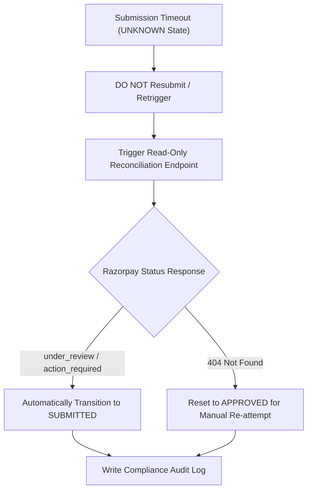

# Post-Go-Live Operations Runbook — Chargeback Shield

## Executive Operational Policy

This runbook establishes standard operating procedures for daily monitoring, SLA management, incident response, UNKNOWN submission governance, database backups, restore drills, rollback procedures, and credential rotation for Chargeback Shield v1.0.0.

> **PRIMARY ARCHITECTURAL INVARIANT**:
> `"MONITOR → DETECT → INVESTIGATE → RESPOND SAFELY → AUDIT → NEVER BYPASS CONTROLS"`

---

## 1. Governance Schedules & Cadence

| Frequency | Task | Procedure | Responsible Role |
|---|---|---|---|
| **Daily** | Infrastructure Health & Metrics Audit | Inspect `/api/health/ready`, `/api/observability/summary`, and `/observability` dashboard. Verify error rates < 0.1%. | On-Call Site Reliability Engineer |
| **Daily** | SLA & Action-Required Queue Review | Inspect `/api/operations/sla` and `/operations`. Verify 0 overdue disputes. | Chargeback Operations Analyst |
| **Weekly** | Operational Alert & Exception Audit | Review alert detection logs, deduplication stats, and acknowledgement audit records. | Operations Lead |
| **Monthly** | Security & Credential Governance Audit | Audit environment variables, CORS settings, container image tags, and rotated credentials. | Security Officer |

---

## 2. UNKNOWN Contest Submission Governance

> [!CAUTION]
> **CRITICAL OPERATIONAL MANDATE**:
> `"UNKNOWN submission states MUST NOT be blindly retried."`
> When a submission attempt experiences a network drop or timeout, state remains `UNKNOWN`.

### Operational Workflow:

1. **Step 1**: Identify dispute in `UNKNOWN` state from `/api/operations/alerts`.
2. **Step 2**: Execute read-only status check: `POST /api/disputes/{dispute_id}/reconcile`.
3. **Step 3**: Inspect response. If Razorpay acknowledges receipt (`under_review`), update local state to `SUBMITTED`. If not found, reset to `APPROVED` for manual re-attempt.

---

## 3. Database Backup & Restore Governance

- **Backup Frequency**: Daily automated cron execution at 02:00 UTC via `scripts/backup_production.py`.
- **Pre-Restore Mandatory Step**: Create instant snapshot (`backups/pre_restore_snapshot`) before performing any restore operation.
- **Verification Command**: `python scripts/verify_backup.py` (Must confirm 0 database or evidence hash mismatches).

---

## 4. Credential Rotation Governance

1. Secrets must be passed via runtime environment variables (`RAZORPAY_KEY_ID`, `RAZORPAY_KEY_SECRET`).
2. **NEVER** print, log, or commit secret keys to repository or build artifacts.
3. Upon credential rotation, perform `docker compose restart backend` and verify health gate via `/api/health/ready`.
